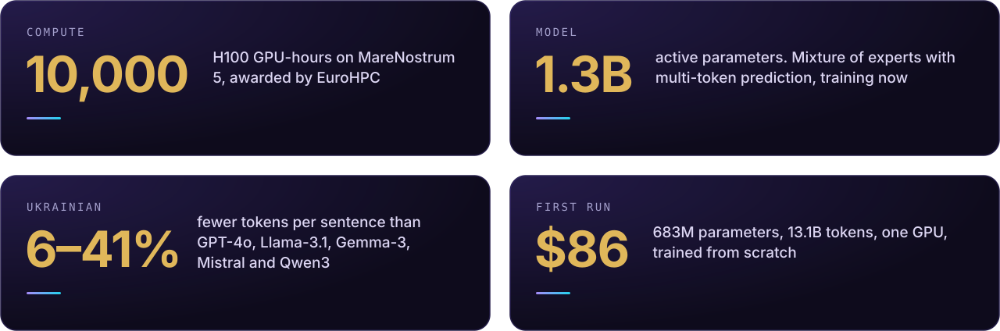
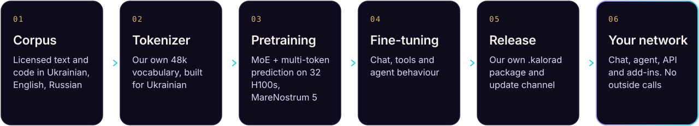
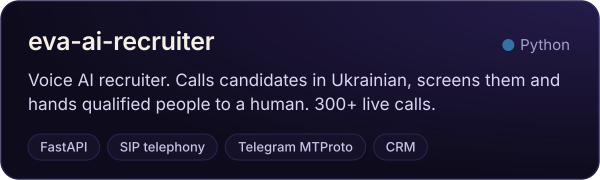
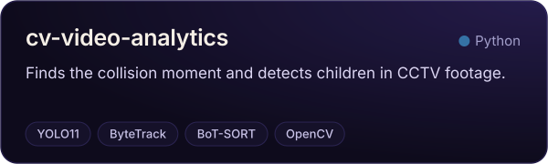
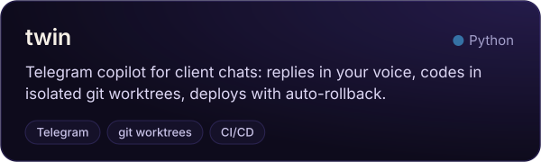
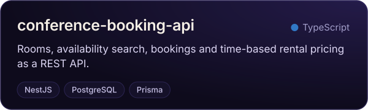
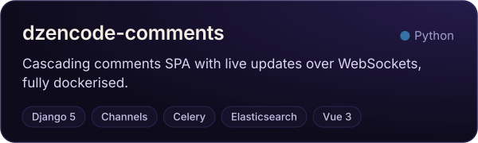
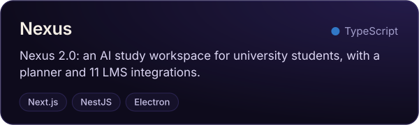
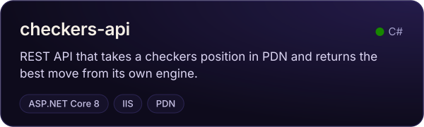
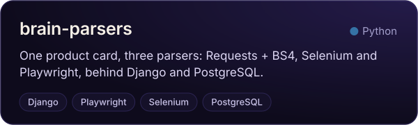

I'm the founder, CEO and chief engineer of **[Kalorad](https://kalorad.app)**. We train our own language model from zero and build the assistant that runs on it inside a customer's own network. No calls to anyone else's AI, weights the customer can own outright, and a tokenizer made for Ukrainian.

It's for the people who can't send their documents to a foreign vendor: banks, hospitals, ministries, law firms.

## How it's made

**The model.** Our first full pretraining run finished in September: 683M parameters, 13.1B tokens, one GPU, $86 of compute. The production model is a mixture of experts with multi-token prediction and 1.3B active parameters. It has a fast mode and one that thinks longer. It's training now on MareNostrum 5 at the Barcelona Supercomputing Center, on 10,000 H100 hours from the EuroHPC AI Factory call. I wrote the training stack (Slurm jobs, DDP and FSDP, the Muon optimizer, torch.compile) and found the bug that had been making training 39% slower.

**The product.** Chat and an agent that works with Google Workspace, Microsoft 365, KeyCRM, Bitrix24 and email. MCP in both directions. Add-ins for Word, Excel, PowerPoint and Outlook, an add-on for Google Workspace, desktop apps for Windows and macOS, and an OpenAI-compatible API, so anything already built for that API plugs in unchanged.

**The team.** Three engineers: me, plus two who joined in October 2026. The code is closed. Results go to [LinkedIn](https://www.linkedin.com/in/bohdan-havryliuk-370762386) as they come, including the runs that go wrong.

## Open work

Most client work is under NDA. These are the public pieces.

## Toolbox

                

## Before Kalorad

Five years of full-stack work for private clients in C#/.NET, Python and TypeScript, two of them leading a team. In 2025 and 2026 I worked on the other side of model training: AI Trainer at Meta, then AI Training Contractor at Scale AI, reviewing and rating model output, mostly code. BSc (Hons) Artificial Intelligence, De Montfort University, First Class.

<a href="mailto:bohdan@kalorad.app">bohdan@kalorad.app</a> · <a href="https://kalorad.app">kalorad.app</a> · <a href="https://www.linkedin.com/in/bohdan-havryliuk-370762386">LinkedIn</a>

