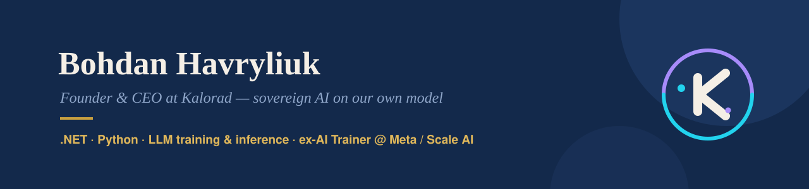

## Bohdan Havryliuk

Founder & CEO at **Kalorad** &#8212; a sovereign AI platform that runs on our own model instead of third-party APIs. I build the whole thing: the model, the backend, the billing, the growth loop.

### Kalorad

One subscription replaces a stack of five AI tools. What is inside:

**KaloradLM** &#8212; 1.3B decoder-only model (GQA / SwiGLU / RoPE / RMSNorm, 4k context) with a daily self-training loop: automatic scoring, checkpoint promotion, rollback on regression.

**Platform** &#8212; ASP.NET Core 9, streaming chat, RAG with cite-or-abstain, decaying long-term memory, permissioned tool router, 20 vertical agent packs, OpenAI-compatible API.

**Monetisation** &#8212; Stripe subscriptions and one-off SKUs, usage metering, a gamified loyalty layer with published odds.

**Security** &#8212; audited the app and fixed CSRF across 33 of 37 POST endpoints plus a stored XSS, then added a site-wide CSP, rate limiting and account lockout.

No third-party AI APIs anywhere in the stack: own weights, own inference, own training pipeline.

### Selected work

| Project | Stack | What it does |
|---|---|---|
| [ai-recruiter](https://github.com/bogdan734/ai-recruiter) | Python, FastAPI, Vapi, Telnyx, PostgreSQL | Voice AI recruiter that calls candidates in Ukrainian, screens them and moves cards through the CRM. 300+ live calls |
| [dzencode-comments](https://github.com/bogdan734/dzencode-comments) | Django 5, DRF, Channels, Celery, Redis, Elasticsearch, Vue 3 | Cascading-comments SPA with WebSocket updates, JWT auth, XSS/SQLi protection, fully dockerised |
| [Nexus](https://github.com/bogdan734/Nexus) | ASP.NET Core, PostgreSQL, Redis, Avalonia | Licensing platform with hardware-bound activation and AES-256 encrypted script delivery |
| [AI-Numerology-Report-SaaS](https://github.com/bogdan734/AI-Numerology-Reroprt-SaaS) | Python, FastAPI, Jinja2, SMTP | End-to-end report SaaS: landing, checkout, generation, branded PDF, email delivery |

### Stack

`C#` `.NET / ASP.NET Core` `Python` `PyTorch` `FastAPI` `Django` `TypeScript` `PostgreSQL` `SQLite` `Redis` `Docker` `Stripe`

### Background

BSc (Hons) Artificial Intelligence, De Montfort University. AI Trainer at Meta, AI Training Contractor at Scale AI. 5+ years of full-stack engineering, two of them leading a team.

&#128235; [LinkedIn](https://www.linkedin.com/in/bohdan-havryliuk-370762386) &#183; kaloradteam@gmail.com
